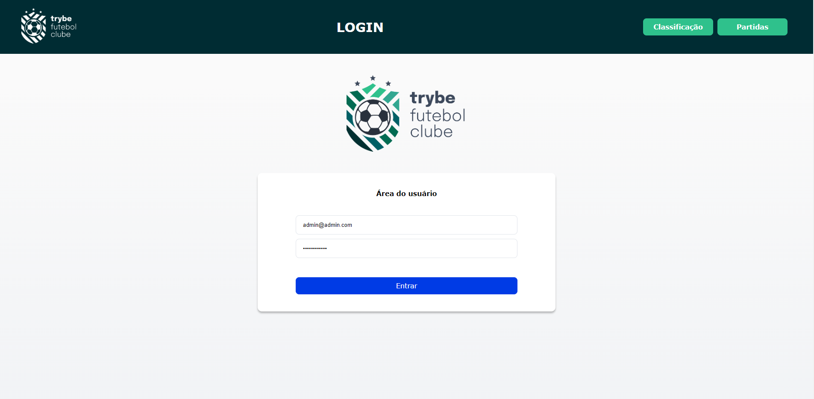
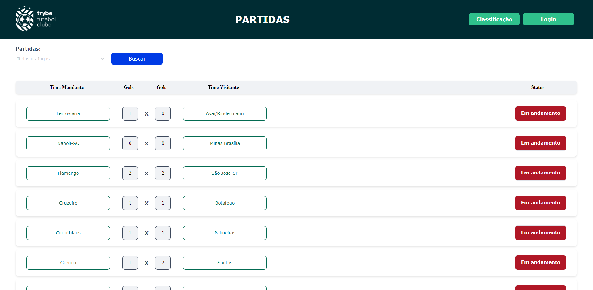
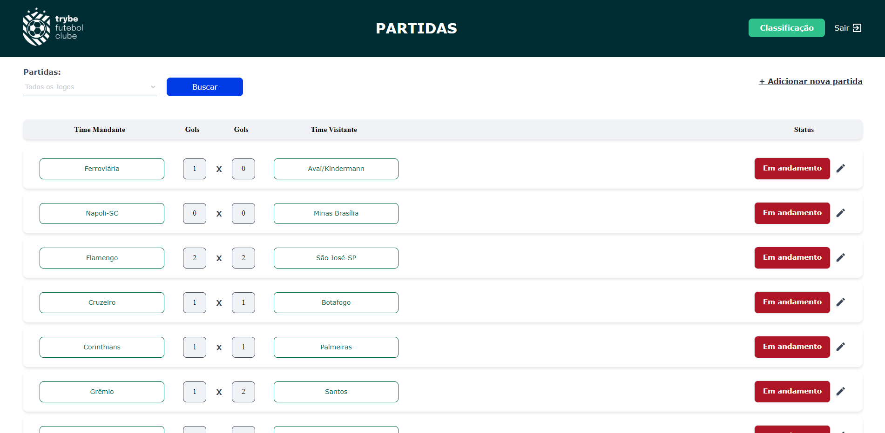
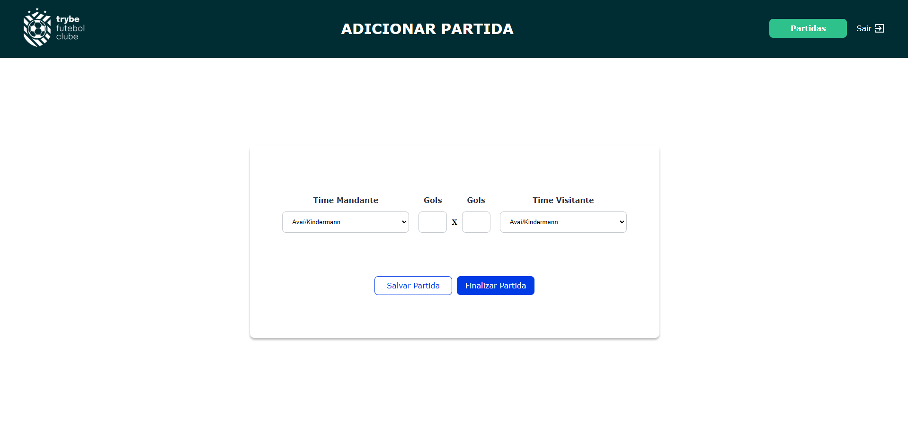
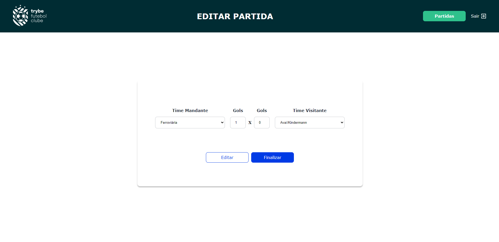

# FrontEnd

O FrontEnd foi uma aplicação inicialmente disponibilizada pela Trybe, e foram realizadas poucas refatorações. A aplicação foi desenvolvida utilizando `React`, nela é possível consumir a API desenvolvida no backend pela url `http://localhost:3001` através dos endpoints desenvolvidos no backend. Originalmente o nome da aplicação é **Trybe Futebol Clube**.

## Conteúdo

- [FrontEnd](#frontend)
  - [Conteúdo](#conteúdo)
- [**Recursos**](#recursos)
    - [**Leaderboard**](#leaderboard)
    - [**Login**](#login)
    - [**Partidas**](#partidas)
    - [**Criação e Edição de Partidas**](#criação-e-edição-de-partidas)
- [**Instruções**](#instruções)
    - [**Instalação e Execução**](#instalação-e-execução)
- [**Linter**](#linter)
- [**Observações**](#observações)

# **Recursos**
Os recursos serão listados conforme as páginas.

### **Leaderboard**

A tela inicial da aplicação é a de classificação de times. Nela é possível ver a classificação de todos os times cadastrados na API, e também é possível filtrar por times da casa e times visitantes.


### **Login**

Na tela de login o usuário pode acessar a aplicação com e-mail e senha. Algumas funcionalidades da aplicação só podem ser acessadas após o login com uma conta de administrador.



### **Partidas**

Na tela de partidas é possível ver todas as partidas cadastradas na API, e também é possível filtrar por partidas que já aconteceram e partidas que estão em andamento.



Quando o login é efetuado e o usuário é um administrador, é possível adicionar novas partidas.



### **Criação e Edição de Partidas**

Seguindo a mesma observação anterior sobre usuários administradores é possível cadastrar novas partidas com o time da casa, time visitante, gols do time da casa e gols do time visitante.




# **Instruções**

Para executar o projeto utilizando Docker siga as instruções no README do projeto [aqui](https://github.com/vitorbss12/FullStack-App-Football-Championship-Scoreboard)

### **Instalação e Execução**

Para executar o FrontEnd como deveria é necessário que a API esteja rodando.

`Scrips` de instalação e execução:
####
**Instalar dependências:**
````
npm install
````

**Iniciar a aplicação:**
````
npm start
````

# **Linter**

Este projeto foi desenvolvido utilizando o linter `ESLint` seguindo as boas práticas definidas na [Trybe](https://www.betrybe.com/).

  - Para executar o linter, basta executar o comando:
````
npm run lint
````
  - Para executer o style linter, basta executar o comando:
````
npm run lint:styles
```` 

# **Observações**

- Quer saber mais sobre mim? Veja o meu [LinkedIn](https://www.linkedin.com/in/vitorbss/).
